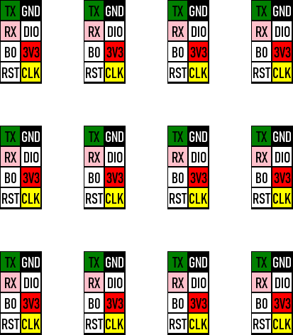

Can be used to create a screw terminal label

Can be used to create grids of labels to be cut out with a cricut.

When printing the image is calculated out at 300 dpi

Ensure the image is printed at the original size.
